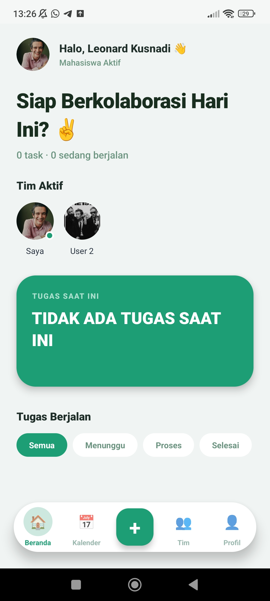
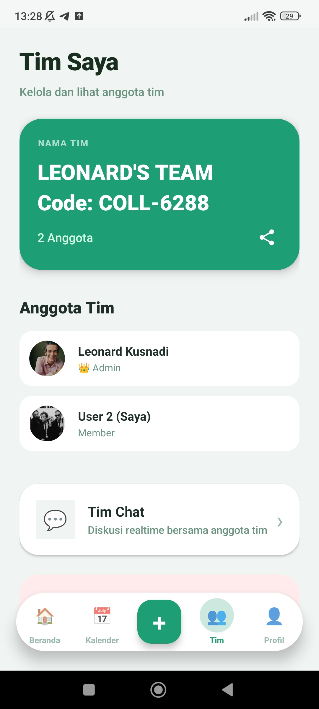
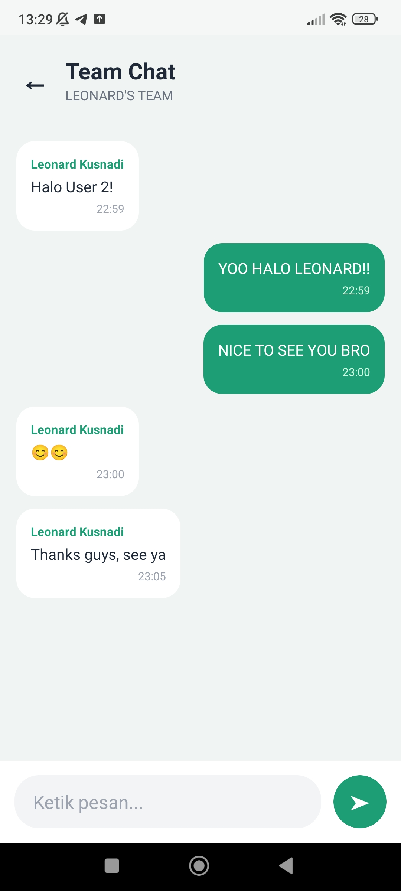
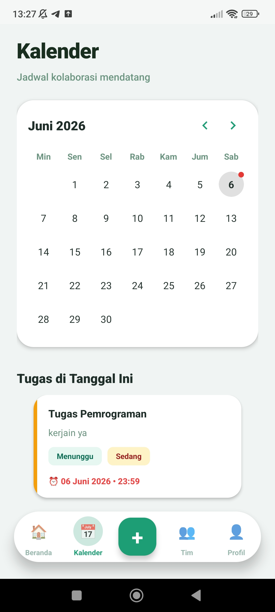
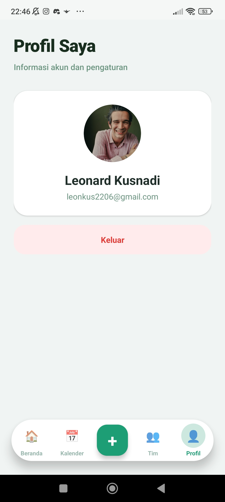

# Collabora

An Android-based Team Collaboration Application built with Kotlin and Firebase.

## Overview

Collabora is a mobile application designed to help teams collaborate more effectively through task management, team communication, and shared scheduling.

The application provides a centralized workspace where team members can manage tasks, communicate in real time, and track important deadlines.

## Features

### Team Management

* Create and manage teams
* Invite members using team codes
* Role-based collaboration (Admin & Member)

### Task Management

* Create and assign tasks
* Track task progress
* Monitor deadlines and completion status

### Team Chat

* Real-time team communication
* Shared workspace discussions
* Instant message synchronization

### Team Calendar

* View upcoming schedules
* Track project deadlines
* Manage team activities visually

### User Profile

* User authentication
* Profile management
* Profile image upload with Cloudinary

## Tech Stack

* Kotlin
* Android Studio
* Firebase Authentication
* Cloud Firestore
* Cloudinary
* Glide

## Screenshots

### Dashboard

### Team Management

### Team Chat

### Team Calendar

### Profile

## Demo Video

🎥 Full Application Walkthrough:

https://youtu.be/8hDPbpJ3jZ0

## Learning Outcomes

Through this project, I gained hands-on experience with:

* Android application development using Kotlin
* Firebase Authentication integration
* Cloud Firestore real-time database
* Role-based access management
* Cloud-based image storage and retrieval
* UI/UX implementation for mobile applications

## Author

**Leonard Kusnadi**

* GitHub: https://github.com/leonkusz
* Project Repository: https://github.com/leonkusz/Collabora
